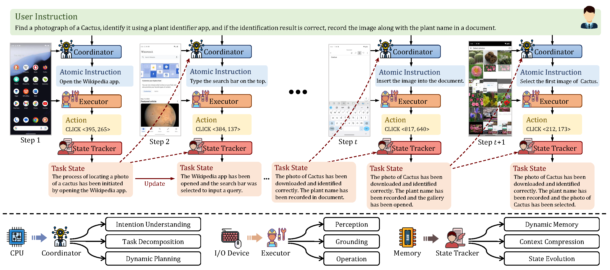
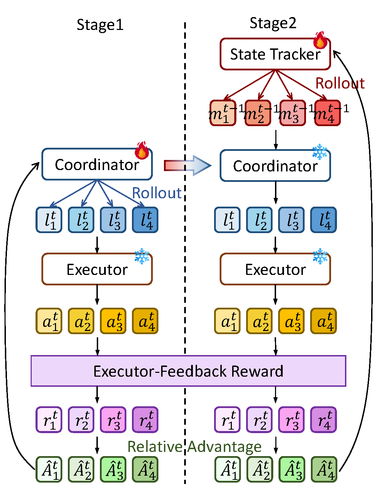

<div align="center">
  
  <h1>Training High-Level Schedulers with Execution-Feedback Reinforcement Learning for Long-Horizon GUI Automation</h1>
  <p align="center">
    🧻<a href="">Paper</a> |
    🤗<a href="">Model</a> |
    🤗<a href="https://huggingface.co/datasets/hehehahi4/CES">Dataset</a>
  </p>

</div>


## 🐘 Introduction

The rapid development of large vision-language model (VLM) has greatly promoted the research of GUI agent. However, GUI agents still face significant challenges in handling long-horizon tasks. First, single-agent models struggle to balance high-level capabilities and low-level execution capability, facing prevalent issues of responsibility coupling and capability conflicts. Second, agents lack awareness of the task state, leading to progress loss in long-horizon tasks. 
To address these challenges, we propose a staged execution-feedback reinforcement learning algorithm. Unlike training a unified policy model, we focus on training high-level scheduling models. Specifically, we propose and train two agents: a Coordinator, responsible for the strategic planning and task decomposition; and a State Tracker, responsible for context compression and information management to maintain the task's state and coherence. Based on this, we built the Coordinator-Executor-State Tracker (CES) multi-agent framework, which can be integrated with any low-level Executor model, assisting the Executor in solving long-horizon tasks through task scheduling and state management.
Experiments on long-horizon task benchmarks demonstrate that CES significantly enhances the system's planning and state management capabilities. Furthermore, analysis confirms that our trained high-level scheduling module is a generalizable, plug-and-play module that significantly enhances the long-horizon capabilities of various Executors

<p align="center">
  
  
</p>

## 🌠 Key Features

* **Multi-Agent Decoupling:** We build CES multi-agent framework, featuring general-purpose, plug-and-play high-level components (Coordinator and State Tracker) that can integrate with various Executors and enhance their abilities.
* **State context compression:** We introduce a State Tracker, whose core task is dynamic context compression and state summarization, effectively resolving the state unawareness problem and maintaining the agent's logical coherence in long-horizon tasks.
* **Staged Execution-Feedback RL:** We propose a staged execution-feedback RL strategy. The core of this algorithm is to decouple high-level capabilities from low-level execution: it freezes a pre-trained Executor and uses the reward signals it generates to exclusively train the high-level Coordinator and State Tracker.
* **Compelling Performance:** Extensive experiments demonstrate that our method significantly enhances the long-horizon scheduling and state management capabilities of various Executor models and surpasses existing baselines.


## 🎭 Getting Started

### 🌲Env
Create conda virtual environment:
```
conda create --name ces python=3.10
conda activate ces
pip install -r requirements.txt
```

### ♨️ Warm-up SFT

We use [LLaMA-Factory](https://github.com/hiyouga/LLaMA-Factory) to do the warm-up sft.

#### 1. Initialize LLaMA-FActory first (you can also follow official repo to initialize)
```
cd LLaMA-Factory
pip install -e ".[torch,metrics]" --no-build-isolation
```
#### 2. Fine-Tuning

The data has been put in `LLaMA-Factory\data`, called `planner_vl_sft` and `memory_sft` respectively.

You just need:
```
bash examples/sft/train_coordinator.sh
bash examples/sft/train_tracker.sh
```

#### 3. Merge LoRA Weights:

```
llamafactory-cli export examples/merge_lora/qwen2_5vl_lora_sft.yaml
llamafactory-cli export examples/merge_lora/llama3_lora_sft.yaml
```

### 💪🏾 Staged Execution-Feedback RL

#### 1. Data Preparation
Download the dataset from huggingface and put them to `./data`

#### 2. Download Executor
We use [GUI-R1-7B](https://github.com/ritzz-ai/GUI-R1) as Executor model, so download it first.

You can also try other powful model, and maybe you can get higher performance.

#### 3. Train Coordinator
Change your SFT_model and data path in `train_coordinator.sh`, and then:
```
cd ../
bash examples/train_rl/train_coordinator.sh
```

#### 4. Train State Tracker
Remember the path of coordinator and change it in `train_tracker.sh`, and then:
```
bash examples/train_rl/train_tracker.sh
```

### ✒️ Eval
We use original data to evaluate directly:
```
python examples/eval/eval.py
```


## 🙏 Acknowledgements
We thank for the code repository: [verl](https://github.com/volcengine/verl), [LLaMA-Factory](https://github.com/hiyouga/LLaMA-Factory), [vLLM](https://github.com/vllm-project/vllm), [SWIRL](https://github.com/Lqf-HFNJU/SWIRL), [GUI-R1-7B](https://github.com/ritzz-ai/GUI-R1).

## 🙏 Cite
